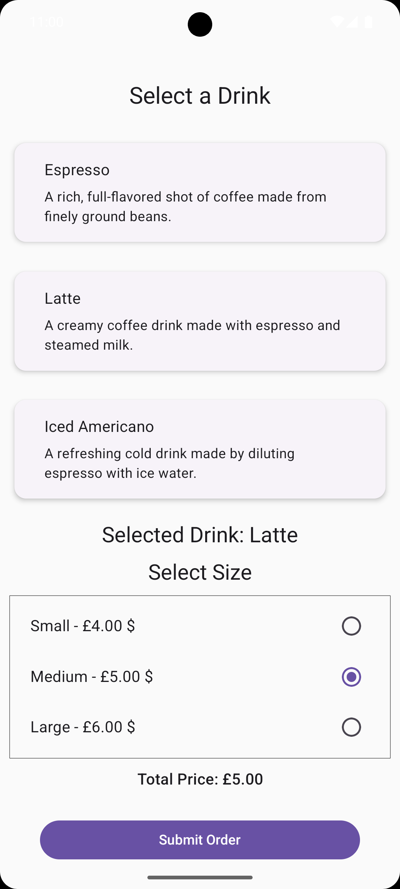
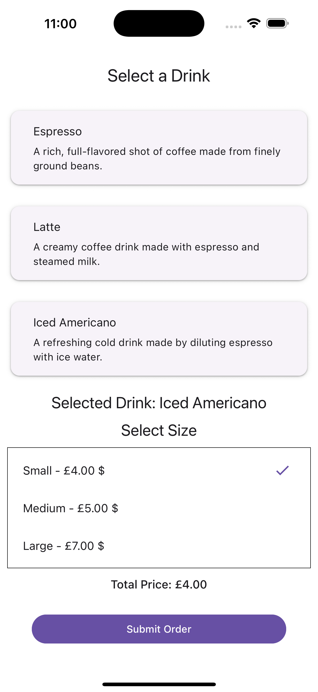

# Barista Mobile Ordering App

A simple React Native app that allows a barista to select a drink, choose its size, and submit the order to a backend.

## Features

- Drink menu with descriptions, sizes, and prices
- Real-time price calculation
- Order submission to backend server
- Styled with [React Native Paper](https://callstack.github.io/react-native-paper/)

## Tech Stack

- React Native (Bare Workflow)
- TypeScript
- React Native Paper
- Axios
- Metro bundler

## Prerequisites

- Node.js (v16 or higher)
- npm or yarn
- React Native CLI
- Android Studio or Xcode
- Backend running on `http://localhost:5001` (iOS) or `http://10.0.2.2:5001` (Android Emulator)

---

## Getting Started

### 1. Clone the Repository

```bash
git clone https://github.com/y-alshazly/ordersMobileClient.git
cd ordersMobileClient
```

## 🏃 Running the Project

- **Start Metro development server**:

  ```bash
  yarn start
  ```

- **Run on Android emulator/device**:

  ```bash
  yarn android
  ```

- **Run on iOS simulator:**:

  ```bash
  yarn ios
  ```

- **Install CocoaPods dependencies (iOS only)**:

  ```bash
  yarn pod-install
  ```

- **Run tests**:

  ```bash
  yarn test
  ```

- **Run linter (check for issues)**:

  ```bash
  yarn lint
  ```

<!-- markdownlint-disable MD033 -->

## 📱 Screenshots

<table>
  <tr>
    <td align="center">
      <strong>Android</strong><br>
      
    </td>
    <td align="center">
      <strong>iOS</strong><br>
      
    </td>
  </tr>
</table>

<!-- markdownlint-enable MD033 -->
